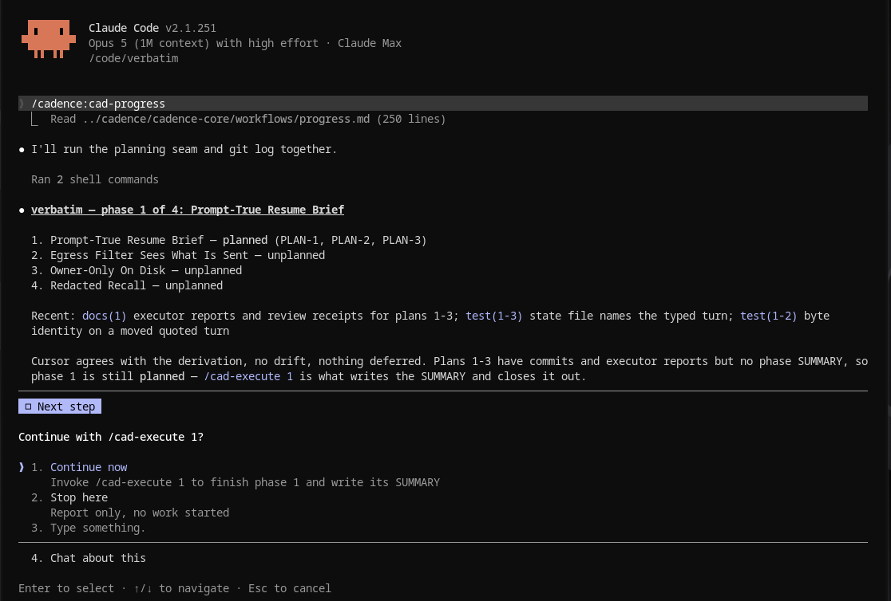

# Cadence

[](https://github.com/crenshawdev/cadence/actions/workflows/test.yml)
[](https://github.com/crenshawdev/cadence/actions/workflows/release.yml)
[](https://github.com/crenshawdev/cadence/releases/latest)
[](LICENSE)

**Appearance is cheap. Verification is the work.**

Cadence is for developers using Claude Code on software they will still own after the session ends.

Claude can write a convincing plan, produce working code, and tell you the job is finished. The harder part is keeping the decisions that led there, stopping a long session from becoming the project record, and establishing that what you got is what you asked for.

Cadence keeps the project in the repository. Decisions, plans, progress, review findings and verification live under `.planning/`, where a new session reads them off disk. A planner, an executor, reviewers and a verifier each work in fresh context, and nothing is certified by the thing that wrote it. You are the engineer of record: you approve the plan, triage what the reviewers find, and authorize every push.



*Cadence rebuilds Verbatim's state from the repo, finds phase 1 executed and awaiting UAT, and offers `/cad-verify 1` as the next step.*

Cadence is deliberately not an autopilot. If you want to describe a feature and come back to a merged PR, this is the wrong tool.

The methodology ships as controls. Each step of the loop has named checks around it, each check records that it ran, and a check that did not run is not a check that passed. The record is a file in your repo, not a claim in a chat window.

## Install

Cadence is a Claude Code plugin. Add the marketplace, then install:

```
/plugin marketplace add https://github.com/crenshawdev/cadence.git
/plugin install cadence@cadence
```

Update with `/plugin update cadence@cadence`, remove with `/plugin uninstall cadence@cadence`. Requires Claude Code with plugin support, plus `node`, `git` and one forge CLI - `tea`, `gh` or `glab` - on your PATH, because Cadence resolves a forge and an issue tracker when it sets a project up. Those are host prerequisites: the scripts inside are zero-dependency, and there is no npm install, ever.

## The loop

Cadence runs as slash commands namespaced `/cadence:cad-*` (for example `/cadence:cad-new-project`). They are written below without the `cadence:` prefix for brevity. A project moves through five steps, each its own command:

1. **`/cad-new-project`** define the project through deep questioning: what, why, who, done.
2. **`/cad-context <phase>`** gather locked decisions and acceptance criteria before planning.
3. **`/cad-plan <phase>`** turn a phase into an executable, checkable plan.
4. **`/cad-execute <phase>`** build it, one atomic commit per task.
5. **`/cad-verify <phase>`** confirm the phase delivered what it promised.

Step 1 has a second door. **`/cad-adopt`** is the entrance for a project that already exists: it reads the repo, the manifests and the git history, writes what the code already does into `PROJECT.md` as shipped work and what is left into a remaining-work `ROADMAP.md`, and asks only what the repo cannot answer. Same `.planning/` on disk either way, so step 2 onward is identical.

Step 1 also takes a shortcut when the questioning already happened somewhere else: **`/cad-new-project --brief <file>`** reads the design brief that conversation produced, treats what it settles as answered, and asks only about what it leaves open. [`docs/DISCOVERY.md`](./docs/DISCOVERY.md) is how you get there from a freeform conversation.

`/cad-progress` tells you where you stand and what's next at any point, and auto-resumes incomplete work.

[](./docs/WORKFLOW.md)

That is five commands out of twenty-eight. `/cad-help` prints the full reference inside a session, and [`cadence-core/references/COMMANDS.md`](./cadence-core/references/COMMANDS.md) is that same reference in the repo, readable before you install anything.

## The controls

Eight of them, and every one hands its decision to you rather than deciding for you.

| Control | Where it fires | What it does |
|---|---|---|
| Plan review | before any code is written | an adversarial reviewer tries to break the plan, findings come back as a numbered list you triage |
| Risk surface | on each plan's completed commit range | checks the diff against eight named surfaces, blocks on a match at every stakes level |
| Push rail | every `git push` a workflow attempts | a `PreToolUse` hook, `cadence-core/bin/git-guard.mjs`, stops and asks you. No exemption exists |
| Protected branch | a commit on `main` or `master` | asks, refuses, or allows, per `git.on_protected` |
| Verification | after a phase is built | conversational UAT plus a goal-backward pass, claims scored verified, failed, or uncertain |
| Traceability audit | before a release ships | `/cad-audit` traces every requirement to a phase, a plan and a verification, both directions |
| Coverage audit | on a completed phase | `/cad-coverage` reads the assertions rather than counting test files |
| The record | every dispatch, always | `.planning/trace.jsonl` prices each subagent, `/cad-report` reads it back as receipts |

Two of those rows, at work:


*The goal-backward pass scores 6 of 8, and both failures are specific: an acceptance criterion no developer-run test actually asserts, and a performance cost that belongs to an earlier version rather than this phase. It asks how to resolve the failure rather than deciding.*


*With verification resolved, the audit traces Verbatim's active requirement to its phase, its plan and a checked verification box, and reports the criteria coverage behind it.*

`/cad-report` renders one phase's record as a narrative, and `/cad-suggest` reads the same record back the other way: it turns what the dispatches actually cost and what the gates actually caught into retune suggestions, each carrying its config key, the value in force, a direction and a target, and it offers to route the ones you accept to `/cad-config`. The controls generate the evidence, and that is what the evidence is for.

The reviewers are adversarial by construction, because you cannot personally re-derive everything the model wrote and neither can I. The default reviewer is a fresh-context Claude subagent and needs no API key. An OpenAI, Gemini, or DeepSeek key runs the identical job as a direct API call, which lets you put up to four independent voices on one plan and have your main session adjudicate against the cited code. Every backend returns the same shape on purpose, because an adjudicator that could tell which finding came from the free reviewer and which from the paid one would start discounting findings for being cheap. The one signal treated as strong is convergence, two reviewers landing on the same defect independently. What survives comes back as a multi-select prompt whose default is none of it, never a queue the model starts working through.

`/cad-minimalism-review` points the same posture at code that works and should not exist, an abstraction with one implementation, flexibility nothing exercises, config nobody sets, and hands back a ranked delete-list. It applies none of it.

## How it works

Cadence assumes the model will fail. Not that it is bad at the job, that it will now and then hand you something that looks finished and is not, and that you will not always catch it by reading. Everything else follows: the state stays durable, the workers stay disposable, and the rails sit where a worker cannot argue with them.

Nothing important lives in the conversation. The roadmap, the plans, the summaries, the verification checklist and the four-line state cursor all sit in `.planning/` and in git history, and every command rebuilds what it needs from disk. Clear the window at any phase boundary and you lose nothing. There is no resume, a continuation is a fresh spawn that reads the prior artifact off disk, and every one of those spawns lands in the run record where you can read what it cost.

A check that could not run never passes a gate. A reviewer that failed says why out loud instead of quietly dropping out of the set. The verifier scores every claim as verified, failed, or uncertain, and uncertain counts toward neither side. A test that would still pass if the behavior were wrong is not coverage, which is why the coverage audit reads assertions.

The git rails are a `PreToolUse` hook rather than a paragraph of instructions, because a model will talk itself around a paragraph and it will not talk itself around a hook.

That shape was expensive to learn, and I paid for it twice. First a predicate called `isPlainPush` that would recognize a safe push and wave it through, very clever, and four rounds of adversarial review found four ways around it. Then a shell tokenizer, which took two milestones and the 2,251 lines v2.2.0 deleted before I admitted it could be switched off entirely by a long enough command line, in a hook that fails open. Both are gone. The one sanctioned push runs through a subprocess the hook never sees, built from an argument vector rather than a shell string, and what the guard reads now is eighty-five lines: a command counts if it starts with the word `git`. `bash -c "git push"` is invisible to it, and that is written down rather than left to be discovered.

[`METHOD.md`](./METHOD.md) is the full account of what the planner, executor, verifier and reviewers do and where each rule is enforced. [`INTERNALS.md`](./INTERNALS.md) is the mechanism underneath: routing, the publish seam, and why the decision cores are pure functions. [`docs/WORKFLOW.md`](./docs/WORKFLOW.md) is the same material as a diagram, five figures and the four tables behind them. [`docs/EVIDENCE.md`](./docs/EVIDENCE.md) defines the three weight terms and gives the `weight.mjs` commands that print the current numbers for any tree. [`docs/COST.md`](./docs/COST.md) is what a run costs on my own account. [`docs/EXAMPLE.md`](./docs/EXAMPLE.md) walks one small project through the whole cycle.

## What a break costs

Cadence used to ask how much you wanted a dispatch to cost. It now asks what happens if the work is wrong, which is a question you can actually answer about your own project, and that answer routes everything else. One key sets it:

```
/cad-config stakes=shipped
```

`solo` means nobody else runs this and a break costs you an afternoon. `shipped` means other people run it and a break comes back as a bug report. `critical` means a break is not a bug report.

The level you set is a MINIMUM a phase pays, not a fixed price: a phase whose declared files touch a risk surface routes ABOVE it, and leaving `stakes` unset is what lets a phase touching none of them route below the old default. [`INTERNALS.md`](./INTERNALS.md) has the mechanism.

That one word lands in a grid of 18 cells, one per level and role pair, and the cell hands a dispatch its model, the effort rung it starts on, and the rung a failed attempt climbs to. At `solo` the planner runs Sonnet at `high`. At `shipped` it runs Opus. At `critical` it runs Opus at `xhigh` and a retry goes to `max`. The whole thing is [`cadence-core/route-table.json`](./cadence-core/route-table.json) and you can read it in one screen.

The rungs are `low`, `medium`, `high`, `xhigh`, `max`. Effort is fixed in an agent file's frontmatter rather than passed per dispatch, which makes a rung a real file on disk, and self-verify fails in both directions, on a cell naming a rung with no file and on a rung file no cell reaches.

Escalation is one key, `model.escalate_on_failure`, off by default: a retry holds the rung it started on, because a retry is usually a narrower job than the pass that failed it. Set it true and a failed attempt gets re-dispatched at the retry rung its own cell names.

The review gates resolve off the same level:

| Trigger | `solo` | `shipped` | `critical` |
|---|---|---|---|
| `plan` | advisory | blocking | adjudicated |
| `diff` | off | off | blocking |
| `phase_diff` | off | off | adjudicated |
| `risk_surface` | blocking | blocking | blocking |

A plan review is blocking at `shipped` because a plan is the cheapest artifact in the pipeline to halt on. `risk_surface` is the one row that does not move, and the eight surfaces it watches are auth, billing, secrets, migrations, destructive operations, concurrency, API contracts, and untrusted input. None of those care how casual your project is.

That list is yours to narrow as of v3.2.0. `review.triggers.risk_surface.surfaces` names the subset your project actually contains, populated from a structural scan of manifests and directories rather than a keyword grep, and leaving it unset keeps all eight so nobody's coverage shrinks on upgrade. A keyword pass was measured on this repo on 2026-08-13 and false-positived `auth` on sixteen hits of the word `session`, every one of them a Claude session.

Cadence checks that list against the diff itself, once per plan, on the completed commit range. As of v3.5.0 the check is a seam rather than an instruction: `planning.mjs risk-check run` answers a resolved commit range with what it checked, what it matched, and whether it could judge the range at all, and it writes that record to the run trace on every invocation, including the ones that match nothing. A gate that only leaves bytes behind when it fires makes a skipped check and a clean one look identical, and a plan now cannot report done until the record exists. `inconclusive` is a real third answer for a binary file or a submodule bump rather than something folded quietly into "clean". Detection is still heuristic and does not claim otherwise. What changed is that whether it ran is a fact you can read instead of an absence you have to trust.

It used to check the file NAMES a plan declared, at dispatch time, and raise the whole phase on a match. A test file called `ingest_concurrency.rs` was enough to put six roles on their top rung for the rest of the phase, and that detector is gone as of v2.7.0. What the code does decides, what the file is called does not.

Deep verification follows the level too, off at `solo` and on at `shipped` and `critical`.

## Where it came from

Cadence descends from [GSD](https://github.com/open-gsd/gsd-core), the discuss/plan/execute/verify loop, which is where I first ran into it. GSD gets the hard thing right and then buries it. Seventy-one skills, thirty-four agents, forty-six capabilities underneath those, and one-point-one million words of documentation wrapped around a four-step idea, which is an elephant being a mouse built to government standards. I kept the loop and threw out the standards. Cadence carries about 3% of GSD's documentary mass, measured 2026-07-10 against GSD commit d010ea1. Today it is 28 skills and 6 agent roles across 19 rung files.

Every one of those cuts was made by hand and written down. [`DESIGN.md`](./DESIGN.md) numbers the locked decisions and the reversals, [`INTERNALS.md`](./INTERNALS.md) walks the handful that took more than one try to get right, [`LINEAGE.md`](./LINEAGE.md) publishes the counts and tells you how to reproduce them, and [`MANIFESTO.md`](./MANIFESTO.md) is the why. CI fails the build when the prose drifts from the code, because every config key, script flag, and file path named in these docs has to actually exist.

Cadence is a derivative work of GSD by Open GSD, used under the MIT License. The original copyright is retained in [`LICENSE`](./LICENSE) and the lineage is spelled out in [`NOTICE`](./NOTICE.md). Cadence is maintained by John Crenshaw and distributed under the MIT License.

<a href='https://ko-fi.com/R5Y823KUXE' target='_blank'></a>
