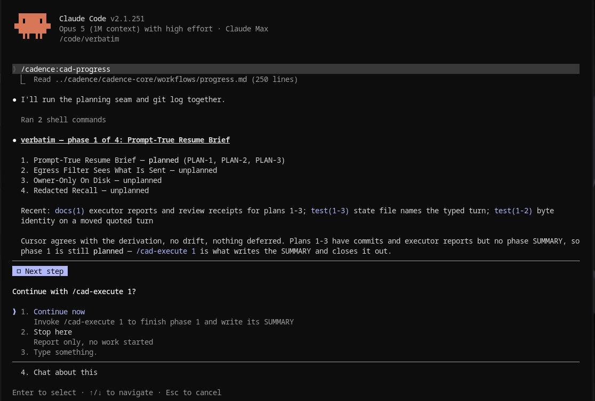
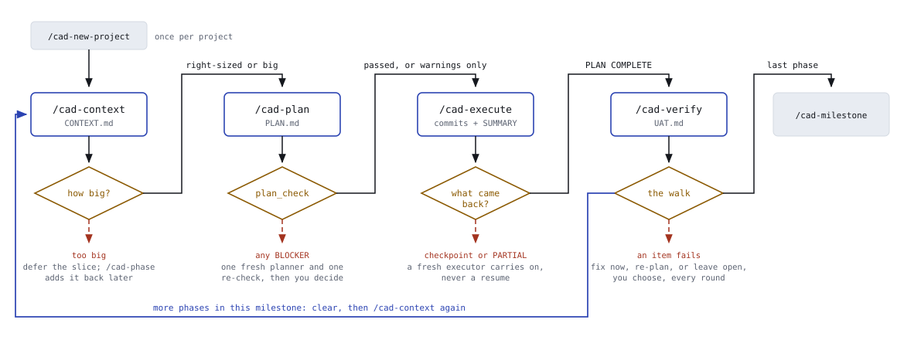

# Cadence

[](https://github.com/crenshawdev/cadence/actions/workflows/test.yml)
[](https://github.com/crenshawdev/cadence/actions/workflows/release.yml)
[](https://github.com/crenshawdev/cadence/releases/latest)
[](LICENSE)

**Appearance is cheap. Verification is the work.**

Cadence is for developers using Claude Code on software they will still own after the session ends.

Claude can write a convincing plan, produce working code, and tell you the job is finished. The harder part is keeping the decisions that led there, stopping a long session from becoming the project record, and establishing that what you got is what you asked for.

Cadence keeps the project in the repository. Decisions, plans, progress, review findings and verification live under `.planning/`, where a new session reads them off disk. A planner, an executor, reviewers and a verifier each work in fresh context, and nothing is certified by the thing that wrote it. You are the engineer of record: you approve the plan, triage what the reviewers find, and authorize every push.



*Cadence rebuilds Verbatim's state from the repo, finds phase 1 executed and awaiting UAT, and offers `/cad-verify 1` as the next step.*

Cadence is deliberately not an autopilot. If you want to describe a feature and come back to a merged PR, this is the wrong tool.

The methodology ships as controls. Each step of the loop has named checks around it, each check records that it ran, and a check that did not run is not a check that passed. The record is a file in your repo, not a claim in a chat window.

## Install

Cadence is a Claude Code plugin. Add the marketplace, then install:

```
/plugin marketplace add https://github.com/crenshawdev/cadence.git
/plugin install cadence@cadence
```

Update with `/plugin update cadence@cadence`, remove with `/plugin uninstall cadence@cadence`. Requires Claude Code with plugin support, plus `node`, `git` and one forge CLI - `tea`, `gh` or `glab` - on your PATH, because Cadence resolves a forge and an issue tracker when it sets a project up. Those are host prerequisites: the scripts inside are zero-dependency, and there is no npm install, ever.

On Claude Code 2.1.284 and later, when managed settings set `allowManagedPermissionRulesOnly`, a plugin from a marketplace no longer pre-approves its own tools through `allowed-tools` unless managed settings vouch for its source, so Cadence's commands ask before using their tools on those machines. Nothing changes anywhere else.

## The loop

Cadence runs as slash commands namespaced `/cadence:cad-*` (for example `/cadence:cad-new-project`). They are written below without the `cadence:` prefix for brevity. A project moves through five steps, each its own command:

1. **`/cad-new-project`** define the project through deep questioning: what, why, who, done.
2. **`/cad-context <phase>`** gather locked decisions and acceptance criteria before planning.
3. **`/cad-plan <phase>`** turn a phase into an executable, checkable plan.
4. **`/cad-execute <phase>`** build it, one atomic commit per task.
5. **`/cad-verify <phase>`** confirm the phase delivered what it promised.

Step 1 has a second door. **`/cad-adopt`** is the entrance for a project that already exists: it reads the repo, the manifests and the git history, writes what the code already does into `PROJECT.md` as shipped work and what is left into a remaining-work `ROADMAP.md`, and asks only what the repo cannot answer. Same `.planning/` on disk either way, so step 2 onward is identical.

Step 1 also takes a shortcut when the questioning already happened somewhere else: **`/cad-new-project --brief <file>`** reads the design brief that conversation produced, treats what it settles as answered, and asks only about what it leaves open. [`docs/DISCOVERY.md`](./docs/DISCOVERY.md) is how you get there from a freeform conversation.

`/cad-progress` tells you where you stand and what's next at any point: it finds incomplete or paused work and offers to resume it.

[](./docs/WORKFLOW.md)

That is five commands out of twenty-eight. `/cad-help` prints the full reference inside a session, and [`cadence-core/references/COMMANDS.md`](./cadence-core/references/COMMANDS.md) is that same reference in the repo, readable before you install anything.

## The panel

On a Claude Code version with mods support (2.1.287 or later), Cadence also loads a small module that shows where the loop stands without you running a command. On an older version the module never loads and everything else works exactly as before.

A one-line band sits above the prompt in any repo with a `.planning/` directory: the phase you are on, its status, any Cadence agent running right now with its rung, and the next command. It redraws when an agent starts or returns and after every tool call, so a `cursor set` shows up as soon as it lands. In a repo without `.planning/` there is no band.

`/cad-panel`, or `p` on the band, opens the full view: the current phase's plans and which are done, each running agent with its role, rung and model, the UAT counts, the open captures, the phase's token spend (the same figure `/cad-report` prints, with its exclusions named), and the next command. When the cursor and the files disagree about which phase is open, the panel says so instead of picking one.

The module only reads. It never runs a Cadence command, never writes `STATE.md`, and never takes over the git rail: git-guard stays the command hook it has always been. It does two quiet jobs besides drawing. It keeps Cadence's 30 agent descriptions and 6 internal contract skills out of every session's prompt, about 8,000 characters Claude would otherwise reread on every request in every project, while Cadence's commands still dispatch those agents by name. And it prices the subagent dispatches whose return carried no token count, from the host's own usage for that agent, so `/cad-report` has fewer gaps.

## The controls

Eight of them, and every one hands its decision to you rather than deciding for you.

| Control | Where it fires | What it does |
|---|---|---|
| Plan review | before any code is written | an adversarial reviewer tries to break the plan, findings come back as a numbered list you triage |
| Risk surface | on each plan's completed commit range | checks the diff against eight named surfaces, and blocks on a match by default |
| Push rail | every `git push` a workflow attempts | a `PreToolUse` hook, `cadence-core/bin/git-guard.mjs`, stops and asks you. No exemption exists |
| Protected branch | a commit on `main` or `master` | asks, refuses, or allows, per `git.on_protected` |
| Verification | after a phase is built | conversational UAT plus a goal-backward pass, claims scored verified, failed, or uncertain |
| Traceability audit | before a release ships | `/cad-audit` traces every requirement to a phase, a plan and a verification, both directions |
| Coverage audit | on a completed phase | `/cad-coverage` reads the assertions rather than counting test files |
| The record | every dispatch, always | `.planning/trace.jsonl` prices each subagent, `/cad-report` reads it back as receipts |

Two of those rows, at work:


*The goal-backward pass scores 6 of 8, and both failures are specific: an acceptance criterion no developer-run test actually asserts, and a performance cost that belongs to an earlier version rather than this phase. It asks how to resolve the failure rather than deciding.*


*With verification resolved, the audit traces Verbatim's active requirement to its phase, its plan and a checked verification box, and reports the criteria coverage behind it.*

`/cad-report` renders one phase's record as a narrative, and `/cad-suggest` reads the same record back the other way: it turns what the dispatches actually cost and what the gates actually caught into retune suggestions, each carrying its config key, the value in force and a direction, plus a target where the record can price one, and it offers to route the ones you accept to `/cad-config`. The controls generate the evidence, and that is what the evidence is for.

The reviewers are adversarial by construction, because you cannot personally re-derive everything the model wrote and neither can I. The default reviewer is a fresh-context Claude subagent and needs no API key. An OpenAI, Gemini, or DeepSeek key runs the identical job as a direct API call, which lets you put up to four independent voices on one plan and have your main session adjudicate against the cited code. Every backend returns the same shape on purpose, so each finding is ruled on against the code it cites and never on which reviewer raised it. Each ruling still records its voice, which is what lets you count every reviewer's hit rate. The one signal treated as strong is convergence, two reviewers landing on the same defect independently. What survives comes back as a multi-select prompt whose default is none of it, never a queue the model starts working through.

`/cad-minimalism-review` points the same posture at code that works and should not exist, an abstraction with one implementation, flexibility nothing exercises, config nobody sets, and hands back a ranked delete-list. It applies none of it.

## How it works

Cadence assumes the model will fail. Not that it is bad at the job, that it will now and then hand you something that looks finished and is not, and that you will not always catch it by reading. Everything else follows: the state stays durable, the workers stay disposable, and the rails sit where a worker cannot argue with them.

Nothing important lives in the conversation. The roadmap, the plans, the summaries, the verification checklist and the four-line state cursor all sit in `.planning/` and in git history, and every command rebuilds what it needs from disk. Clear the window at any phase boundary and you lose nothing. There is no resume, a continuation is a fresh spawn that reads the prior artifact off disk, and every one of those spawns lands in the run record where you can read what it cost.

A check that could not run never passes a gate. A reviewer that failed says why out loud instead of quietly dropping out of the set. The verifier scores every claim as verified, failed, or uncertain, and uncertain counts toward neither side. A test that would still pass if the behavior were wrong is not coverage, which is why the coverage audit reads assertions.

The git rails are a `PreToolUse` hook rather than a paragraph of instructions, because a model will talk itself around a paragraph and it will not talk itself around a hook.

That shape was expensive to learn, and I paid for it twice. First a predicate called `isPlainPush` that would recognize a safe push and wave it through, very clever, and four rounds of adversarial review found four ways around it. Then a shell tokenizer, which took two milestones and the 2,251 lines v2.2.0 deleted before I admitted it could be switched off entirely by a long enough command line, in a hook that fails open. Both are gone. The one sanctioned push runs through a subprocess the hook never sees, built from an argument vector rather than a shell string, and what the guard reads now is eighty-five lines: a command counts if it starts with the word `git`. `bash -c "git push"` is invisible to it, and that is written down rather than left to be discovered.

[`METHOD.md`](./METHOD.md) is the full account of what the planner, executor, verifier and reviewers do and where each rule is enforced. [`INTERNALS.md`](./INTERNALS.md) is the mechanism underneath: routing, the publish seam, and why the decision cores are pure functions. [`docs/WORKFLOW.md`](./docs/WORKFLOW.md) is the same material as a diagram, five figures and the four tables behind them. [`docs/EVIDENCE.md`](./docs/EVIDENCE.md) defines the three weight terms and gives the `weight.mjs` commands that print the current numbers for any tree. [`docs/COST.md`](./docs/COST.md) is what a run costs on my own account. [`docs/EXAMPLE.md`](./docs/EXAMPLE.md) walks one small project through the whole cycle.

## What Cadence sends, writes and reads

Cadence sends no telemetry, makes no network call of its own except to a cross-model reviewer you turned on, and keeps its record in your repository. Everything else it touches outside the project is listed here, so you don't have to find it by reading the scripts.

### Cross-model reviewers

They're off by default. The shipped reviewer is the Claude subagent, which needs no key and sends nothing your session isn't already sending. A provider runs only when your user-global config's `review.reviewers` names it as well as the project's, so a repository's committed `review.reviewers` can't send your code to a provider on your key by itself, and cloning a repo that lists `openai` changes nothing until you've named `openai` yourself. Naming a provider there authorizes it for every repository whose own config names it too, and `/cad-config --review` asks before it writes that.

| Provider | Host | Key |
|---|---|---|
| OpenAI | `https://api.openai.com` | `OPENAI_API_KEY` |
| Gemini | `https://generativelanguage.googleapis.com` | `GEMINI_API_KEY` |
| DeepSeek | `https://api.deepseek.com` | `DEEPSEEK_API_KEY` |

The key comes from the environment first. When the variable isn't set, `cadence-core/bin/review-provider.mjs` reads it from `~/.config/cadence/providers.env` (under `$XDG_CONFIG_HOME` when that's set), or from the file `review.key_file` names in your user-global config. That's a script reading a credential off your machine, which is what the plugin directory flags, and it stays that way on purpose: a plugin `userConfig` secret only reaches hooks and MCP servers, and the review calls run through Bash. The key is never written to a config file or printed, and each key goes only to its own provider's host.

`review-provider.mjs` makes three calls, each to that host with that key:

- `review` sends the review instruction and the artifact under review, a plan or a diff, after credential redaction. It runs when a review gate fires with that provider in the reviewer set, and at `/cad-decision-review`.
- `consult` sends a short description of a dead end, the goal, what was tried and the exact failing signal, after the same redaction. It runs only with `review.consult.enabled` true, and only after you say yes to an offer that names the provider and model. `/cad-debug`, `/cad-execute` and `/cad-plan` make that offer.
- `detect-models` sends no project content, only the key as the request's credential, to list the provider's models when you run `/cad-config --review`.

Redaction catches a credential by its shape, a credential-shaped name beside its value, a URL's userinfo, an `Authorization` header, and not by a list of known prefixes. A bare key sitting in a diff with nothing naming it goes out as written, so don't point a reviewer at a secrets file.

### Your forge

Every forge write goes through your own `tea`, `gh` or `glab`, signed in as you:

- `repo create --private`, once, at `/cad-new-project`, after you confirm the owner and name;
- `issue create`, with an `issue list` first to find a duplicate, when you send a review finding to the tracker instead of fixing it now;
- PR or MR create and merge at `/cad-land`, when you pick that arm, or unattended when `git.auto_close` is true in both the repository's config and your user-global config.

### Optional MCP tools

Context7 and excerpt are used when they're installed and skipped when they're not, and Cadence installs neither. Without Context7, `/cad-decision-review` checks library and API claims against the installed package source, the lockfile or vendored docs, and lists every claim it couldn't check. Without excerpt, every agent reads and searches with the built-in Read and Grep.

### The module

On a host with mods, the module does five things:

- draws the band and the `/cad-panel` pane from `planning.mjs` reads and the files under `.planning/`;
- filters Cadence's 30 agents and 6 contract skills out of the agent and skill listings the model sees;
- rewrites the Agent tool's `subagent_type` from a bare Cadence agent name to the plugin-prefixed one, and leaves your own agents' names alone;
- adds `--agent-id <id>` to a Cadence subagent's own `planning.mjs trace close` command, so the record joins it to the right dispatch;
- appends token-count facts to `.planning/trace.jsonl` through `planning.mjs trace append`.

That trace is the only file it writes. It never touches `STATE.md` or the git rail.

### The two hooks that watch

- `subagent-trace` reads the stopped subagent's own transcript, the file the host keeps for that agent, to price the dispatch in `.planning/trace.jsonl`.
- `read-trace` logs the path of each project file a tool call opens to `.planning/reads.jsonl`. Paths only, never contents, and a path outside the project is never recorded.

### Outside the project

What Cadence writes outside your repository:

- `~/.claude/cadence/config.json`, or the file `CADENCE_GLOBAL_CONFIG` names, when a setup interview or `/cad-config` saves a machine-wide answer;
- `CAPTURE.md` beside that config, from `/cad-capture --cadence`;
- the `worktree.baseRef` key, merged into `.claude/settings.json` or `~/.claude/settings.json`, only after you pick the file at `/cad-config`;
- scratch directories from `mktemp` under `TMPDIR`, or `/tmp` when it's unset.

What it reads outside it: your user-global config, `providers.env` or the `review.key_file` file during a provider call, and `~/.claude/settings.json` and the platform's `managed-settings.json` to learn `worktree.baseRef` before running plans in parallel worktrees.

### Why every command keeps Bash open

Every Cadence command except `/cad-help` lists `Bash` in `allowed-tools` with no command pattern, so it doesn't ask before running a shell command. Narrowing that looks safer and isn't:

- Cadence's own seam calls are typed by the model, and the form varies, a quoted `${CLAUDE_PLUGIN_ROOT}` path one time, an exported variable or a relative path the next. A permission rule matches only the exact form it names, so a narrowed command would stop and ask about its own scripts.
- Workflows run compound scratch lines with `node -e` read-backs and `case ... esac` guards. The only rule that covers those allows arbitrary code, which narrows nothing.
- Some commands run things with no fixed form at all. `/cad-execute`, `/cad-task` and `/cad-coverage` run `workflow.test_command` or a detected test runner, `/cad-spike` runs experiment code, and `/cad-debug` reruns reproductions.
- `/cad-land` runs forge merge commands, and the unattended `/cad-milestone` into `/cad-land` chain can't stop to ask about them. A prompt that shows up mid-run stalls that chain where nobody is watching.

Pushes are still guarded by git-guard, a hook rather than a permission rule, and the one push it never sees is the unattended close above.

### Privacy

No telemetry, no analytics, no phoning home. The only network calls Cadence makes itself are the three provider calls above, each on the terms stated there. Forge and push traffic goes through your own `tea`, `gh`, `glab` and `git`. The planning record, the run trace and the reads log stay in `.planning/` in your repository and go wherever you push it. Cadence runs inside Claude Code, so what your session sees goes wherever Claude Code sends it, which is the host's policy and not this plugin's.

## What each role costs

Cadence used to ask how much you wanted a dispatch to cost, and then it asked what a break in the project would cost. Both were one word standing in for twelve decisions somebody else had already made for you. It asks you the twelve now, one role at a time:

```
/cad-config --roles
```

Thirteen questions in four prompts. Six name a role and ask which model it runs on, six ask which effort rung it starts at, and the last asks what a detected risk surface should be allowed to do. Every question says what that role does in the phase loop and what a stronger or weaker answer buys you there, so the interview is the documentation and there is nothing to read first. `/cad-new-project` and `/cad-adopt` ask them once, machine-wide; `/cad-config --roles` re-opens them for one project, and `--roles --global` re-opens the machine-wide answers.

Your answers are twelve keys, `roles.<role>.model` and `roles.<role>.effort`, and nothing derives one role's answer from another's. A model left unset sends NO model parameter at all, so that dispatch runs on your own session's model, and a model name this host does not accept is named in the resolve's warnings with the parameter dropped, so a typo can never redirect your spend. The effort keys ship with real defaults - `high` for the planner, the assumptions analyzer, the executor and the verifier, `medium` for the reviewer, `low` for the plan checker - and every one of the five rungs is reachable for every one of the six roles.

The rungs are `low`, `medium`, `high`, `xhigh`, `max`. Effort is fixed in an agent file's frontmatter rather than passed per dispatch, which makes a rung a real file on disk, and self-verify refuses a rung the map names with no file, and a rung-suffixed agent file the rung map files for no role.

Escalation is one key, `model.escalate_on_failure`, off by default: a retry holds the rung it started on, because a retry is usually a narrower job than the pass that failed it. Set it true and a failed attempt is re-dispatched one rung higher, holding at the top rung.

The review gates are keys of their own, each with its own default, and whatever you write into one is what fires:

| Trigger | Default gate |
|---|---|
| `plan` | advisory |
| `diff` | off |
| `phase_diff` | off |
| `risk_surface` | blocking |

The `plan` gate ships advisory rather than blocking because a detected risk surface is what raises it, and a plan is the cheapest artifact in the pipeline to halt on when that happens. `risk_surface` is the one that ships blocking, because it only fires on a detection match in the first place, and the eight surfaces it watches are auth, billing, secrets, migrations, destructive operations, concurrency, API contracts, and untrusted input. None of those care how casual your project is.

That list is yours to narrow as of v3.2.0. `review.triggers.risk_surface.surfaces` names the subset your project actually contains, populated from a structural scan of manifests and directories rather than a keyword grep, and leaving it unset keeps all eight so nobody's coverage shrinks on upgrade. A keyword pass was measured on this repo on 2026-08-13 and false-positived `auth` on sixteen hits of the word `session`, every one of them a Claude session.

Cadence checks that list against the diff itself, once per plan, on the completed commit range. As of v3.5.0 the check is a seam rather than an instruction: `planning.mjs risk-check run` answers a resolved commit range with what it checked, what it matched, and whether it could judge the range at all, and it writes that record to the run trace on every invocation, including the ones that match nothing. A gate that only leaves bytes behind when it fires makes a skipped check and a clean one look identical, and a plan now cannot report done until the record exists. `inconclusive` is a real third answer for a binary file or a submodule bump rather than something folded quietly into "clean". Detection is still heuristic and does not claim otherwise. What changed is that whether it ran is a fact you can read instead of an absence you have to trust.

It used to check the file NAMES a plan declared, at dispatch time, and raise the whole phase on a match. A test file called `ingest_concurrency.rs` was enough to put six roles on their top rung for the rest of the phase, and that detector is gone as of v2.7.0. What the code does decides, what the file is called does not.

A phase whose declared files touch one of those surfaces, read at plan time before any code exists, does exactly two things: the plan review becomes blocking, and the deep verify pass turns on. No role's model moves and no role's rung moves, so what you set is what dispatches. No key turns deep verification on - that floor does, `/cad-verify --deep` is the manual switch, and `workflow.verifier: false` is the off switch. [`INTERNALS.md`](./INTERNALS.md) has the mechanism.

## Where it came from

Cadence descends from [GSD](https://github.com/open-gsd/gsd-core), the discuss/plan/execute/verify loop, which is where I first ran into it. GSD gets the hard thing right and then buries it. Seventy-one skills, thirty-four agents, forty-six capabilities underneath those, and one-point-one million words of documentation wrapped around a four-step idea, which is an elephant being a mouse built to government standards. I kept the loop and threw out the standards. Cadence carries about 3% of GSD's documentary mass, measured 2026-07-10 against GSD commit d010ea1. Today it is 28 skills and 6 agent roles across 30 rung files.

Every one of those cuts was made by hand and written down. [`DESIGN.md`](./DESIGN.md) numbers the locked decisions and the reversals, [`INTERNALS.md`](./INTERNALS.md) walks the handful that took more than one try to get right, [`LINEAGE.md`](./LINEAGE.md) publishes the counts and tells you how to reproduce them, and [`MANIFESTO.md`](./MANIFESTO.md) is the why. CI fails the build when the live prose drifts from the code. Of those four only `INTERNALS.md` is linted, and in the docs that are, every config key and script flag named has to actually exist, and so does every plugin-root path and every repo path `INTERNALS.md` cites.

Cadence is a derivative work of GSD by Open GSD, used under the MIT License. The original copyright is retained in [`LICENSE`](./LICENSE) and the lineage is spelled out in [`NOTICE`](./NOTICE.md). Cadence is maintained by John Crenshaw and distributed under the MIT License.

## Baley

[Baley](https://github.com/crenshawdev/baley) is Cadence's successor, a tool for keeping AI coding agents accountable to the person who answers for their work. Its README says it is designed and being built, not ready to use, and nothing has been released. Cadence is still the tool to use today.

<a href='https://ko-fi.com/R5Y823KUXE' target='_blank'></a>
