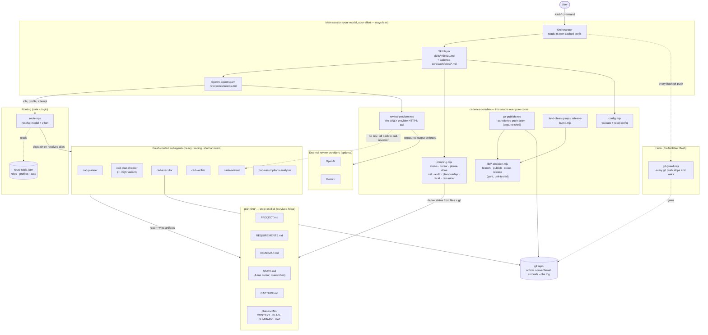
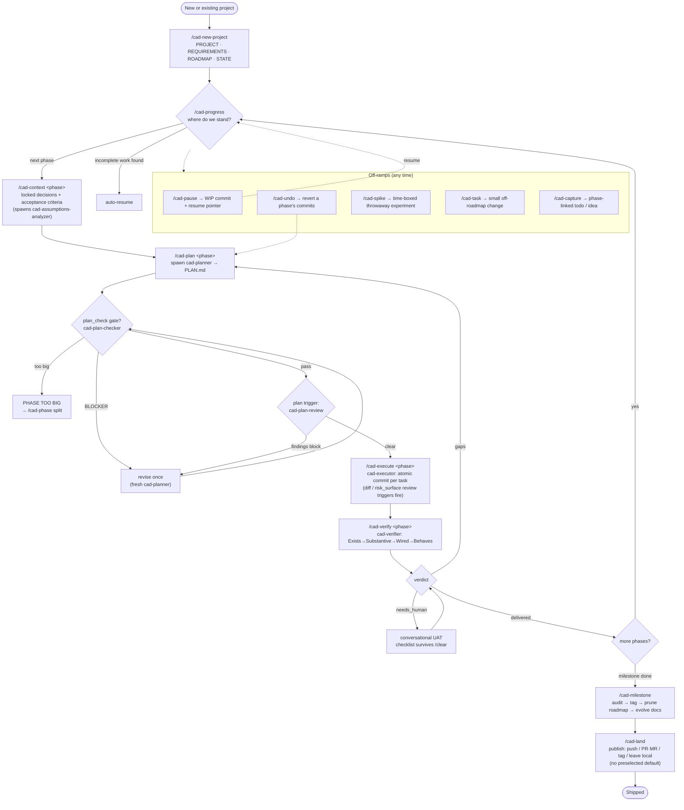
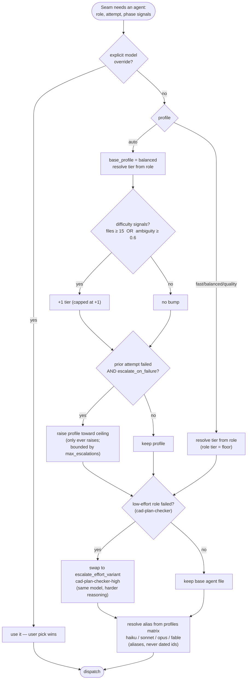
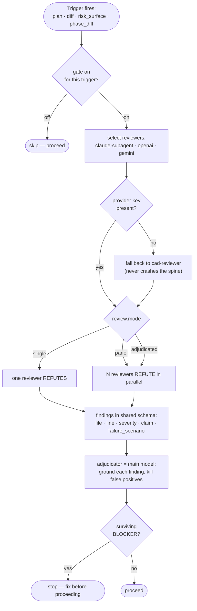
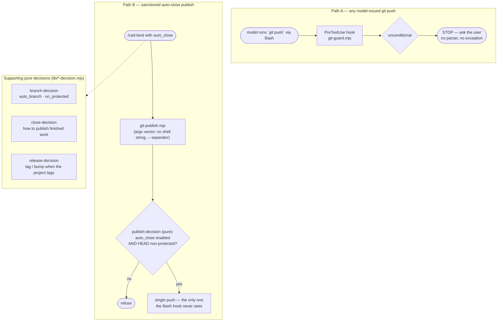
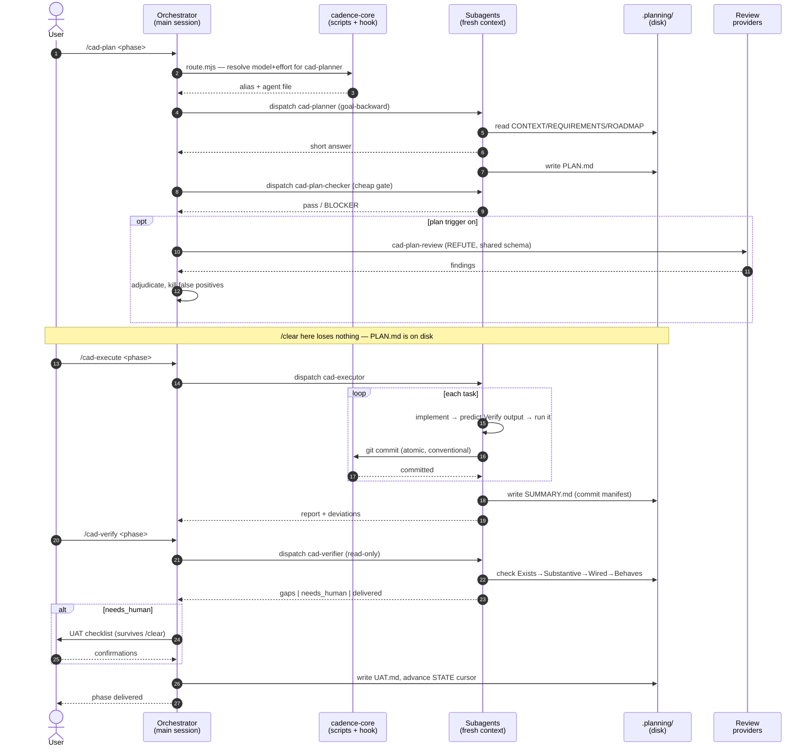

# Cadence process flows

Code-accurate flowcharts for Cadence's runtime: the static architecture, the
lifecycle loop, the three decision cores that took more than one try to get
right, and one loop iteration drawn as swim lanes. Every node traces to a real
file. Render on GitHub or any Mermaid viewer.

Legend for the whole document:

- **Skill** = a `/cad-*` command (`skills/<name>/SKILL.md`) that runs a procedure in `cadence-core/workflows/<name>.md`.
- **Agent** = a fresh-context subagent (`agents/cad-*.md`), dispatched through the spawn-agent seam.
- **Seam/script** = a `cadence-core/bin/*.mjs` file; decision cores are the pure `lib/*-decision.mjs` functions.
- **State** = a file under `.planning/`.

---

## 1. System flowchart — static architecture

Who talks to whom. The main session stays lean; heavy reading happens in routed
subagents that hand back a short answer. State lives on disk, not in the chat.

---

## 2. Program flowchart — the lifecycle loop

The spine: `discuss → plan → execute → verify → ship`, one phase at a time, plus
the off-ramps (`pause/resume`, `undo`, `spike`, `task`, `capture`). `/clear`
between any two steps loses nothing — the next command rebuilds from `.planning/`.

---

## 3. Decision flowcharts — the three cores

### 3a. Model routing + escalation (`route.mjs` over `route-table.json`)

Model is a live lever; effort is frozen in agent frontmatter. `auto` bumps tier
at most one step on difficulty, and escalates the *profile* only upward on a
failed attempt, bounded by a ceiling. Your explicit pick always wins.

### 3b. Review gate (per trigger, adjudicated)

Review is a pure function: artifact in, structured findings out. Cadence subagent
and external providers emit the *same* schema so the adjudicator merges them
blind. The main model kills false positives.

### 3c. Git publish / close (`git-guard` hook + `*-decision` cores)

Two paths to git. Everything the Bash hook can see stops and asks. The one
sanctioned auto-close push happens in a subprocess seam the hook cannot see,
gated by a pure refuse-function — never by out-parsing a shell string.

---

## 4. Swim lanes — one loop iteration (plan → execute → verify)

Where control and token cost actually move across a single phase. Note the
pattern: the orchestrator dispatches and adjudicates but never does the heavy
reading; subagents burn tokens in fresh contexts and hand back short answers;
`.planning/` is the hand-off medium, so a `/clear` between lanes is free.

---

*Traceability: routing → `cadence-core/bin/route.mjs` + `route-table.json`;
review → `review-provider.mjs` + `agents/cad-reviewer.md` + `config.schema.json`
`review.*`; git → `bin/git-guard.mjs`, `bin/git-publish.mjs`, `bin/lib/*-decision.mjs`;
state → `bin/planning.mjs` + `templates/`; hook → `hooks/hooks.json`.*
