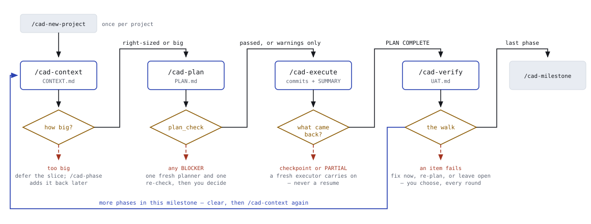
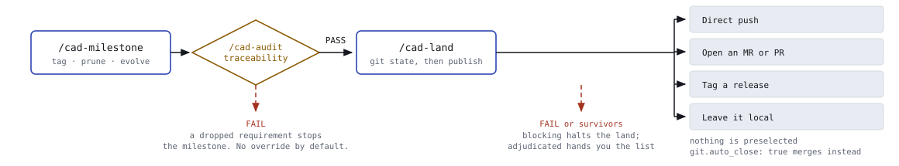
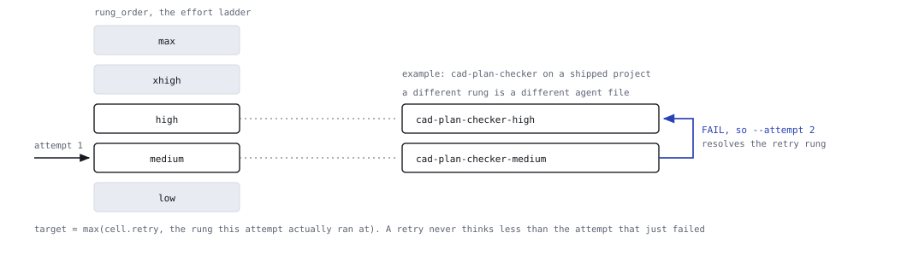
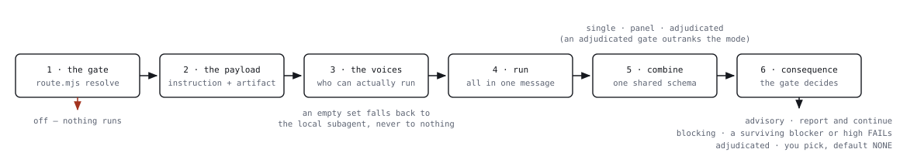

# Cadence: the loop

**One phase, four commands, and every place it can stop you.**

Cadence is a loop with brakes. The four spine commands are the easy part; what
makes it a method is the set of gates between them, the effort ladder that
decides how hard each subagent thinks, and the rule that no agent ever grades
its own work.

---

## 1. The phase loop

Define the project once with `/cad-new-project`. After that every phase runs the
same four steps, and you clear context between them. The loop closes at
`/cad-verify`: more phases send you back to `/cad-context`, the last one sends
you to `/cad-milestone`.

*Four commands, four gates. Every gate has a way through and a way out; the only
path that returns to the top is a phase the walk actually passed.*

Reading the figure: a solid arrow is the path when a gate passes, a dashed rust
arrow is the branch when it does not, a diamond is a decision that can stop you,
and the blue line is the loop closing.

---

## 2. Every decision point, and where each branch lands

Fig. 1 shows four gates because four is what fits. There are fifteen. Some are
yours to answer, some the system answers from evidence; none of them silently
pick the convenient branch.

| Where | The decision | What each branch does |
|---|---|---|
| `/cad-context` | How big is this phase? | Asked once, as one structured question. **Right-sized**, one plan. **Big**, `/cad-plan` splits it into PLAN-1, PLAN-2 in the same phase. **Too big**, the split is captured in the same exchange and the deferred slice is recorded under `Deferred`, for you to add later with `/cad-phase`. |
| `/cad-context` | Did the analyzer come back? | A failed or timed-out assumptions analyzer falls back to a plain conversational pass, and says so out loud. There is no silent degradation. |
| `/cad-plan` | What did the planner return? | `PLANNING COMPLETE`, on to the check. `PHASE TOO BIG`, a consult is offered, then you pick: restructure the roadmap with `/cad-phase` and re-plan, or plan the full scope anyway with one more dispatch. Nothing returned, plans on disk win, otherwise it stops. |
| `/cad-plan` | Does the plan survive `plan_check`? | On by default (`workflow.plan_check`; `--skip-check` bypasses). **Passed**, continue. **Warnings only**, fold the worthwhile ones in and continue; warnings never buy a re-check. **Any blocker**, exactly one revision: a *fresh* planner at `--attempt 2`, then one re-check. Still blocked, and it goes to you. There is no third round. |
| `/cad-plan` | The `plan` review trigger | Fires once the plan is written. **advisory**, report and carry on. **blocking**, a FAIL halts. **adjudicated**, a numbered survivor list where **NONE is the default**. It never re-enters the checker loop; this is the second opinion, not another iteration. |
| `/cad-execute` | Parallel or sequential? | Parallel only when *all* of these hold: parallelization enabled, enough plans, no plan consuming another's output, declared `files:` lists that provably do not overlap, worktrees on, and a worktree base that reports itself parallel-safe. Any overlap, any undeclared file, any seam returning not-ok: sequential. Unproven never parallelizes. |
| `/cad-execute` | What did the executor return? | `PLAN COMPLETE`, collect the report. **Checkpoint**, route it, then dispatch a fresh continuation. `PLAN PARTIAL`, hashes confirmed against the git log, then you choose: continue from task *k*, or stop and let the rest become open items. **Silence**, inspect the log and ask. A plan is never re-run on top of its own partial commits. |
| `/cad-execute` | What kind of checkpoint? | **Structural**, a consult is offered, then you approve, adjust, or stop the phase - it fires when a task's Verify cannot be met, a locked decision is contradicted, or a fix needs a file outside the plan's lease. **Human-verify, decision, blocked**: relayed to you verbatim. Every continuation is a new executor. A risky diff is not a checkpoint: `risk_surface` fires once per plan on the committed range. |
| `/cad-execute` | The goal check | Deliberately *not* a gate. It runs inline, every claim carrying a `file:line` or command output, and any gap it finds becomes an open item in the phase SUMMARY rather than a fix loop. |
| `/cad-verify` | Run the deep pass? | Yes on `--deep`, or on the first UAT session for the phase when routing says `verify: on`. `workflow.verifier: false` is the off switch, and an off state is stated in one line rather than skipped quietly. A failed deep pass never blocks the human walk; it is an accelerator, not a gate. |
| `/cad-verify` | Did this item pass? | Inferred from your own words: pass, skipped, blocked or fail, with severity inferred too (crash reads as blocker, "wrong" as major, "a bit slow" as minor). You are never shown pass/fail buttons and never asked to rate severity. |
| `/cad-verify` | What to do with a failure | Diagnosed inline, fix proposed, then your call. **Apply now**, one atomic commit, guard and `risk_surface` fire at commit time, item back to pending for a retest. **Re-plan**, the item stays failed and you take it to `/cad-plan` yourself; it is never auto-run. **Leave open**, recorded, move on. No silent batch-fixing, no fix-retest-fix without you between rounds. |
| `/cad-audit` | PASS or FAIL | **PASS** only with zero broken traces and zero coverage breaks. **FAIL** on any requirement untraced, unplanned, unverified, dropped or drifted, or on any coverage break at all. Frontmatter noise and scope-creep orphans are reported but do not move the verdict. There is no PASS-with-warnings. |
| `/cad-milestone` | The audit gate | Runs `/cad-audit` first. FAIL stops the milestone unless you explicitly override. The version bump has its own halts, a downgrade or a non-upgrade stops before any tag is cut. |
| `/cad-land` | `pre_ship`, then how to publish | A blocking FAIL halts the land; an adjudicated result gives you a survivor list with NONE as the default, and `pre_ship` re-fires *at most once* after your fixes. Then the publish question, with **no option preselected**: push, open an MR or PR, tag, or leave it local. With `git.auto_close: true` the ask is skipped and a surviving blocker or high severity is a hard halt instead. |

> **The loop that was deliberately not built**
>
> Review, revise, review again until it converges. Cadence refuses it
> everywhere: the checker gets one revision, `pre_ship` re-fires once and
> reports rather than re-triaging, and an adjudicated review grounds its
> findings once and hands off. Convergence loops burn tokens to agree with
> themselves.

---

## 3. Out of the loop: milestone, then land

Publishing is not part of the per-phase loop. When the last phase in a milestone
passes its walk, the traceability audit runs before anything is tagged, and the
publish mechanism is always asked rather than assumed.

*Two gates stand between finished phases and a published branch, and the second
one asks how you want to publish rather than choosing for you.*

---

## 4. The ladder: how hard a subagent thinks

Model is overridable at dispatch time. Reasoning effort is not; it is frozen in
the agent file's own frontmatter. That single constraint is why the ladder
exists as **nineteen files across six roles** rather than a parameter:
dispatching a role harder means dispatching a different file.

| Rung | Where it sits |
|---|---|
| `low` | plan checks on a solo project |
| `medium` | the cheap end of review and verify |
| `high` | where most spine work sits |
| `xhigh` | critical work, and most retries |
| `max` | a failed attempt on critical work |

*Escalation is unconditional across every stakes level, fires whenever
`attempt > 1`, and can only climb. CI refuses any table that would demote a
rung, and refuses any rung file whose declared effort disagrees with the slot it
is filed under.*

### Where each role starts, and where a retry lands

Eighteen cells, keyed on `(stakes, role)`. Each names a model and two rungs:
where the first attempt starts, and the floor a second attempt climbs to.

| Role | solo | shipped (default) | critical |
|---|---|---|---|
| `cad-planner` | sonnet · high → xhigh | opus · high → xhigh | opus · xhigh → max |
| `cad-assumptions-analyzer` | sonnet · high → xhigh | opus · high → xhigh | opus · xhigh → xhigh |
| `cad-plan-checker` | sonnet · low → high | sonnet · medium → high | opus · xhigh → xhigh |
| `cad-executor` | sonnet · high → xhigh | opus · high → xhigh | opus · xhigh → xhigh |
| `cad-reviewer` | sonnet · medium → high | opus · xhigh → xhigh | opus · xhigh → max |
| `cad-verifier` | sonnet · high → xhigh | opus · medium → high | opus · xhigh → max |

The routed vocabulary is only `sonnet` and `opus`. Haiku and Fable are reachable
by explicit pin, never by routing. A stakes level missing any part of its row is
treated as a torn table: routing returns not-ok and the caller falls back to the
base agent at the session default rather than dispatching a half-resolved
bundle.

## 5. Who spawns what

Six routable roles, each with a contract that lives in exactly one place and is
preloaded into every rung file for that role. The fan-out is deliberately
narrow: one planner, not a committee.

*Nineteen agent files, six roles, one contract per role. The rung files are
pointer-only stubs so the behaviour is written down exactly once.*

---

## 6. Review: one function, five triggers

No command embeds its own reviewer loop. There is a single `fire(trigger)`
defined in one place, and every review in the system is a call to it.

*Every reviewer, the local fresh-context subagent and each cross-model
provider, returns the same finding shape. The adjudicator merges them without knowing
which voice produced which finding; that identical schema is the bias control,
not a convenience.*

### Which trigger fires where, and what it can do to you

| Trigger | Fired by | What gets reviewed | solo | shipped | critical |
|---|---|---|---|---|---|
| `plan` | `/cad-plan`, and `/cad-plan-review` on demand | the phase plan, before any code | advisory | advisory | adjudicated |
| `diff` | `/cad-execute` | the diff for one completed plan | off | off | blocking |
| `risk_surface` | `/cad-execute`, `/cad-debug`, `/cad-task`, `/cad-verify` | the matching diff, once per plan on the committed range | blocking | blocking | blocking |
| `phase_diff` | `/cad-execute`, parallel path only | the whole phase, once worktrees merge | off | advisory | adjudicated |
| `pre_ship` | `/cad-land` | the full branch diff | advisory | adjudicated | adjudicated |

> **One risk detector, and it reads the diff**
>
> **At plan completion**, the model reads the plan's whole committed range and
> fires `risk_surface` on what it sees - once, never per commit mid-plan. A dispatch-time path match against the phase's declared
> `files:` list was a second detector until v2.7.0: it judged a file by its
> NAME, so one token floored a whole phase to `critical`, and it is gone.
>
> The commit-time filter drops exactly two things, and only on evidence: a
> destructive target proven ephemeral by both `git check-ignore` and an empty
> `git ls-files`, and a secret proven to be a placeholder by both a
> template-shaped file and a stub value. Either half alone still fires. When
> unsure, it fires and says why.

---

## 7. Consult is not review

One more agent-shaped thing, deliberately kept outside the loop. A consult is
decision support at a dead end, never delegation. It is always gated on your
approval, triggered by an observable counter rather than by a model deciding it
feels stuck: three failed attempts in `/cad-debug`, a structural stop in
`/cad-execute`, a plan that came back too big. One consult per dead end.

There is no local-subagent consult. A second Claude is not a second opinion.

---

Drawn from Cadence's own `METHOD.md`, `INTERNALS.md`, `cadence-core/route-table.json`
and the workflow definitions. Gates and rungs shown as configured by default;
every one of them is a config key.
