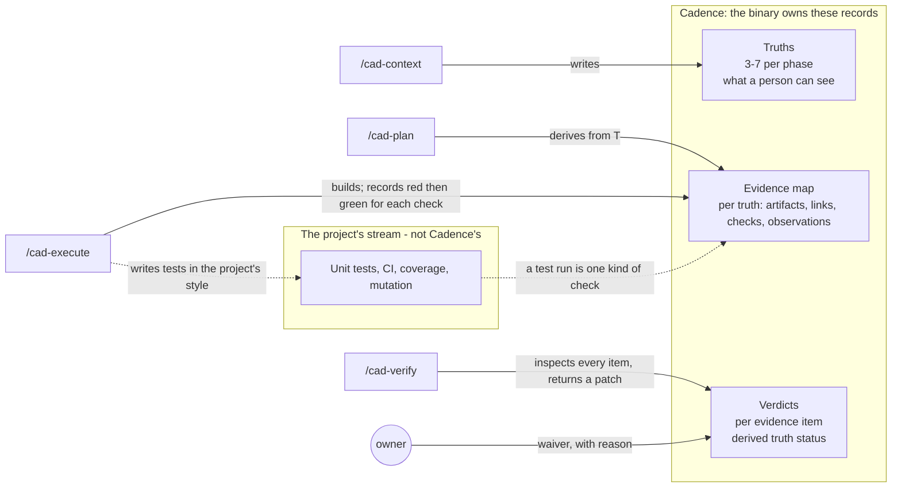

# Acceptance in Cadence 4.0

Design, 2026-09-09. Shape settled with the owner the same day (see "Settled"
at the end). Not yet built; nothing reads it yet. Sources: the three research reports in `.codex-analysis/`
(`ac-shape-research.md`, `ac-plugin-tools-research.md`,
`ac-atdd-tools-research.md`); every borrowed idea below names where it came
from.

**Out of scope, on purpose:** how the project's own unit tests are written,
what they may fake, coverage numbers, mutation testing, and CI. Those are the
project's stream, not Cadence's, and they are a separate discussion. The last
section says exactly where the line is and what that discussion has to settle.

## The one-paragraph version

A phase promises a few things a person can see. Cadence calls each one a
**truth**. For each truth the planner writes down what has to exist and what
has to be connected for that truth to hold - the **evidence map**. The
executor makes it so, and for every check in the map that is a test, records
the test failing before the code and passing after. The verifier then looks
at every piece of evidence for real and returns a **verdict per piece**, and
the binary works out which truths are met, which have concerns, and which
are not. A person can waive a truth; the waiver is recorded as a waiver, never
as a pass. There is no checklist the model ticks.

## Why this shape

Three things the research showed, each from more than one tool that shipped:

1. **Acceptance is a short list of things a user can observe.** 3 to 7 in
   GSD (Cadence's own ancestor), 3 to 6 in Kiro's examples, one story at a
   time in Spec Kit. Never one item per function. Never one per call site.
   The old rules made the criterion a function-level test spec, and one commit
   turned 17 of them into 208. No human reviews 208 of anything.
2. **Tests are a separate stream from acceptance.** Engineer, GSD and
   Superpowers all keep them apart. Acceptance is few and reviewed. Tests are
   many and are the developer's discipline. Cadence had collapsed the two into
   one list, which is why the list was unreviewable.
3. **Verification is a decision with evidence attached**, and an accepted
   failure is recorded as exactly that. GSD's overrides carry a reason, a
   person and a date. TEA's gate keeps rejected evidence visible and caps a
   live observation at "concerns". cc-sdd's one rule: reject a claim broader
   than its evidence.

And one warning, from every tool that built heavy gates: they got pared back.
Superpowers measured its plan-review loop at 25 minutes of overhead for no
quality change and deleted it. Agent OS removed spec verification as bloat.
Every project running mutation testing as a hard gate has carved exceptions.
So this design has four refusal points, each cheap, and no more.

## Where it sits in the flow

Each skill talks to the binary through a tool call. The binary validates
what comes back and refuses what is malformed, in the same envelope every
other answer uses. No hook, no script beside the flow, no prose rule the
model has to remember. Every instruction the model sees - role text, dispatch
prompt, tool description, refusal - is compiled into the binary; the `.md`
files Claude Code requires are rendered from it; a debug build may load them
from disk for tuning; there is no user override. That is what "first class" means here: three record
types in the store, one tool operation per layer, a patch schema for each
role, and the refusals in the binary.

## Layer 1: Truths

**What it is.** A truth is one sentence saying something a person can observe
when the phase is done. It is the phase's promise. It belongs to the phase,
not to a plan, because several plans in one phase deliver the same promises.

**Who writes it.** The user and the model, together, during `/cad-context`.
Truths are locked decisions in the same sense the rest of CONTEXT is. The
binary stores them; CONTEXT.md shows them.

**The sentence shape.** One sentence, fixed order, borrowed from EARS
(Mavin's notation, the one Kiro adopted) but with our own words:

> **When** <one thing happens>, <one observer> **sees / gets / is refused** <one outcome>.

EARS's idea is kept: a trigger first, a response second, one sentence, so a
vague promise cannot be written. EARS's vocabulary is not: "THE SYSTEM SHALL"
names no observer, and "observable from outside" is our refusal rule, so the
sentence names who observes and the rule becomes structural. EARS's
trigger-less "always" pattern is dropped; it is where "shall be secure" lives.

Three structural limits, each checkable without understanding the sentence,
so seven cannot secretly be twenty: **one trigger** (no "or" before the
comma), **one observer** (not "the reviewer and the store"), **one outcome**
(a second clause may only sharpen the same outcome - "is refused, and the
refusal names the commit" - never add another).

**Literal or property.** The response may name a literal ("returns 401") or a
property, written **For any** <input like this>, <observer> **gets** <outcome>. Kiro's
correctness workflow made a property a first-class criterion; the old rules
forbade it. A property is a stronger promise than one example.

**The budget.** At most seven truths per phase; as few as one. GSD's number,
and the number a person can hold while reviewing. Over seven the binary
refuses the set with "split the phase": a phase that needs eight promises is
two phases, and the refusal is information, not punishment. This is the ONE
count rule in the design, and it is a hard refusal.

**What the binary refuses at authoring.**
- Not in an EARS pattern.
- The response is not observable - it names an internal (a function, a field,
  a struct) instead of something seen from outside. Engineer's specs reject
  implementation names; GSD's truths are "from USER's perspective".
- The response is model-generated prose, or its expected value would come
  from a model call. Unchanged from the old rule 5, for the same reason: the
  answer would move without the code moving.
- More than seven.

**The record.** `truth { id, phase, version, pattern, text, kind: literal |
property, status: pending | met | concerns | unmet | waived }`. JSON in the
store, like every other 4.0 record. Change the text and the version bumps;
evidence written against an older version is stale, and verify says so.

## Layer 2: The evidence map

**What it is.** For each truth, the list of things that have to exist and be
connected for the truth to hold, and how each one is checked. This is GSD's
`artifacts` and `key_links` made explicit, plus Superpowers' question - "what
change to the code should break this?" - answered per item.

**Who writes it.** The planner, during `/cad-plan`, reading the code it will
touch. The binary stores it; the plan shows it. Each item names the truth it
serves. An item that serves no truth is refused: it has no reason to exist.
A truth with no item is refused: it cannot be verified.

**One truth, one check. The check IS the truth.** A truth says "when X,
Y sees Z"; its check is: cause X, look at whether Y sees Z. That is one
acceptance test, and the map has room for exactly one per truth - there is no
field for a second. Seven truths, at most seven acceptance tests. The other
evidence kinds are things the verifier inspects, not tests anyone writes.

**Four kinds of evidence.**

| kind | what it says | how it is checked |
|---|---|---|
| `artifact` | this file, symbol or record exists and has substance | the verifier opens it; GSD's verifier rejects a stub, an empty body, a hard-coded placeholder |
| `link` | A hands B this value | a test that stubs B to record what it received and runs A for real - the old wiring shape, kept ONLY where a truth depends on the handoff, never per call site |
| `check` | running this command shows this output | the command runs; output compared to the literal or the property |
| `observation` | a person or a live system has to see it | recorded as seen or not seen by whom and when; can never make a truth `met`, only `concerns` (TEA's cap) |

`observation` is what the old rule 7 sent to `MANUAL.md`. It stays in the map
now, in the same structure, with a different evidence class. Nothing routes
out of sight.

An observation is written into a phase's map only when what it names can be
seen at that phase's close. A phase that builds a part nobody can yet run
carries no observation; the owner's live observations of the assembled thing
belong to the phase that first makes it runnable. For the 4.0 rewrite that is
phase 18, the acceptance gate, which holds the owner's live-host
observations for the phases before it (decided by the owner 2026-09-11).

**What the binary refuses at planning.**
- A truth with no evidence item.
- An evidence item naming no truth, or naming a truth version that no longer
  exists.
- A `check` with no command, or no expected output.
- A `link` whose truth does not mention the value crossing. (This is what
  stops `link` from becoming the multiplier again: it needs a truth that
  needs it.)

**What is deliberately absent.** No rule that every function has an evidence
item. No rule that every call site has one. Checks are bounded by truths (one
each), truths by seven, links by what a truth names, artifacts by what the
truth touches. A
function the phase adds that no truth needs is the project's business - its
unit tests, its dead-code lint - not Cadence's.

**The record.** `evidence { id, truth_id, truth_version, kind, spec,
reason }` where `spec` is the path, the command and expected output, the
caller/callee/value, or the observation text; and `reason` is the one-line
answer to "what change would break this".

## Layer 3: Tests, and what Cadence asks of them

Tests are the project's. Their style, their framework, what they may fake,
how many there are, whether they run in CI - none of that is Cadence's
decision, and this design says nothing about it. See the last section.

Cadence touches a test in exactly one case: **when a test is the `check` for
an evidence item.** Then, and only then, it asks three things:

1. **It has a reason.** It is linked to an evidence item, which is linked to a
   truth. That is the reason. A test with no evidence item is not Cadence's
   concern either way.
2. **It was seen red, then green.** The executor writes the test before the
   code, runs it, records the failure; writes the code, runs it, records the
   pass. Both are in the executor's patch, by commit. This inverts the old
   rule 6 ("do not write a test for code that does not exist"): Engineer, TEA
   and Spec Kit all do it this way, because a failure you watched is the only
   proof the test reaches the code. It also replaces the old rule 11's
   hand-mutation for the common case - red-then-green IS the demonstrated
   failing variant.
3. **It does not fake the thing it claims.** The old rule 10, unchanged in
   substance: a check whose stubbed boundary appears in its own expected
   output is refused. If the truth says a value is stored, the write runs.

**What the binary refuses at execution.** A task closing whose `check`
evidence has no red-then-green record. A `check` that stubs its own subject.

That is all. Granularity, isolation, "one function per test", mocking style -
the old rules 2, 4, 8 and 9 - are not here. They are the project's test-style
choices, and the project's CI enforces them or does not.

## Verify: a decision, not a count

**What the verifier gets.** The truths and the evidence map, from the binary,
for the phase. Not the plan's prose. Not SUMMARY.md - GSD's verifier says it
outright: summary claims are not evidence.

**What it does.** Inspects every evidence item for real. Opens the artifact.
Runs the check. Traces the link. Records the observation as seen or not.
Anthropic's grader rule applies to itself: a passing grade on a weak
assertion is worse than useless, so an item whose spec could not have failed
is marked rejected, not passed.

**What it returns.** A state patch, per 4.0's dispatch contract: one verdict
per evidence item - `accepted | rejected | not_seen` - with what was observed.
The model never writes a truth's status. The binary derives it:

- every item accepted, none `observation` -> `met`
- every item accepted, at least one `observation` -> `concerns`
- any item rejected or not seen -> `unmet`

**Claims no broader than evidence.** cc-sdd's rule, made structural: a truth
is `met` only by its own map. A passing test suite does not make a truth met
if that truth's map has an `artifact` nobody opened or a `link` nobody
traced. The verifier cannot say "tests pass, phase done" because there is no
field for that sentence.

**Waivers.** A person can set a truth to `waived` with a reason, a name and a
date. The report shows it as waived, beside the met ones, never among them.
GSD's override record; TEA's waiver contract. Several waivers in one phase
are the report's cue to say "revisit the plan".

**Rejected evidence stays visible.** TEA keeps the test that named a
requirement and proved none of it. So does this: a rejected item is shown
with why, not dropped, so the next planner sees what did not count.

## The four refusal points, together

| when | the binary refuses |
|---|---|
| truths authored | not EARS; not observable; model-prose oracle; more than seven |
| evidence map planned | truth with no item; item with no truth; check without command and output; link its truth does not need |
| task closes | check with no red-then-green; check that stubs its own subject |
| verdicts returned | a truth status written by the model; a verdict on an item not in the map |

Four, all cheap, all a function of records the binary already holds. Nothing
runs the whole test suite to answer them. That is the whole cost of the
discipline, and it is the answer to "the same test ran a hundred times": the
gates read records, they do not rerun tests.

## Language

The binary reads the manifest at the project root - `Cargo.toml`,
`pyproject.toml`, `package.json`, `go.mod` - the way `detect-commands` already
does for lint and typecheck, and takes from it: the test command, the
test-file pattern, and a one-line note of what a stub is in this language
(a trait impl, `monkeypatch`, `jest.mock`, an interface). That note rides the
planner's and executor's dispatch as vocabulary. The truths, the evidence
kinds, the refusals and the verdicts are the same in every language. A
language the binary does not know gets no note and a warning, and the project
sets the command in config.

## What happens to the old rules

| old rule | where it went |
|---|---|
| 1 Scope | an evidence item points at this phase's artifacts; nothing else needed |
| 2 Granularity, 4 Isolation | the project's test style; not Cadence's |
| 3 Shape | a `check` has a command and an expected output; a truth has a trigger and a response |
| 5 Prose | truth authoring refusal, unchanged in substance |
| 6 Existence | INVERTED: the test is written first and its failure recorded |
| 7 Overflow | `observation` evidence, in the map, capped at `concerns` |
| 8 Wiring | deleted; `link` evidence exists only where a truth needs the handoff |
| 9 Coverage | deleted; a truth needs an item, an item needs a truth, and that is the coverage rule |
| 10 Boundary | execution refusal, unchanged in substance |
| 11 Falsifiability | red-then-green, recorded per check |

No number survives. `docs/rationale/acceptance-criteria.md` is replaced, not
amended. The hook that enforced it is deleted.

## What this does to phases 9 and 10

Phase 9's 158 criteria and phase 10's 187 are function-level test specs, not
truths. Each phase gets its truths re-derived - from the phase goal, not from
the criteria - and an evidence map planned against the code as it stands.
Tests written under the old rules 8 and 9 that serve no evidence item are the
project's to keep or prune under its own style; Cadence stops counting them.
Phase 10's scope is separately reduced to the port plus GH-237/239/240/250/251
before its truths are written. The roadmap entries for phases 11, 12 and 13
are rewritten to build this, not to port the old gates.

## Settled with the owner, 2026-09-09

1. **Seven is a hard refusal**, with "split the phase".
2. **The sentence shape is EARS's idea with our words** - a named observer, a
   fixed verb, one trigger, one outcome. Not EARS vocabulary; not Gherkin.
3. **One check per truth; the check is the truth.** Closes the multiplier one
   layer down from where the old rules opened it.
4. **Truths are authored at `/cad-context`**, with the owner, because they are
   the phase's decisions and several plans share them.
5. **An observation caps a truth at `concerns`.** "Met" means reproducible;
   "seen" is a third state and looks like one.
6. **The binary owns every instruction.** Compiled in, debug-only disk
   loading, no user override. Named testing-style presets are the future form
   of flexibility, never free text.

## Dispatch text until the binary composes prompts

Scaffolding. While dispatches are still hand-assembled during the rewrite,
every prompt that asks a role to plan, execute or verify carries that role's
block below, verbatim. `~/.claude/hooks/rules-gate.mjs` checks for it and
refuses the dispatch otherwise. Phase 12 deletes the hook; the binary then
composes these from state and this section goes with it.

**Planner.** For each truth, write its ONE check: the test that causes the
truth's trigger and looks for its outcome - test file and function, setup,
call, expected result. Add an artifact for each thing that must exist. Add a
link only where the truth itself names a value crossing between two things.
A task's verify names the narrowest command that settles it - one test, one
binary - never the whole suite. Do not write checks for functions, do not
write coverage, and do not write a second check for a truth.

**Executor.** For each check your task delivers: write the test first, run
it, record the commit where it failed; then implement, run it, record the
commit where it passed. Run only what the task names while working. Run the
full suite once, when the plan's last task is done, before you report. Unit
tests beyond the checks are yours: test a unit through what it exposes, fake
only files, clock, other programs and network, skip trivial code, write the
expected value by hand.

**Verifier.** For each evidence item: open it, run it, or trace it. Return a
verdict per item - accepted, rejected or not seen - with what you observed.
A summary is not evidence. An item whose check could not have failed is
rejected, not accepted. You do not set a truth's status; the binary derives
it from your verdicts.

## Unit tests and CI - settled with the owner, 2026-09-09

The line: **Cadence owns truths, the evidence map, the red-then-green record
for checks, and the verdict. The project owns everything about how its tests
are written and run.** Five decisions draw it exactly.

1. **Cadence ships one default test style, as guidance, never as a gate.**
   The executor is told, when the project has set nothing: test a unit through
   what it exposes, not its insides; fake only the outside world - files,
   clock, other programs, network; do not test trivial code (getters,
   forwarding, constructors that only store); write the expected value by
   hand. That is the `classical` preset and the first of the named styles.
   Cadence never counts, never measures coverage, never refuses on style.
2. **CI is not acceptance evidence.** A green pipeline says "nothing we
   already tested broke" - a claim broader than any truth, which is the one
   claim the verifier exists to reject. The verifier cannot cause a CI run
   either. Cadence may SHOW CI status at landing, as information in its own
   column. In the owner's words, CI is the last line of defence and it is for
   the user's trust in their own code, not for Cadence's evidence. The
   acceptance tests Cadence asked for are ordinary tests in the project's
   suite and CI runs them like any other; that needs no rule.
3. **Mutation testing is the project's CI, not a check kind.** Red-then-green
   already proves each acceptance test reaches the code. Mutation earns its
   keep on the unit stream, which is the project's; the research's one clear
   finding is to scope it to the change or it gets switched off. A future
   preset may bundle it; 4.0 does not.
4. **Cadence sets no coverage percentage, test-count budget or tests-per-file
   number.** Any number handed to the model becomes a target it hits - "every
   call site" became 187. Cadence's only numbers are about review: seven
   truths, one check each.
5. **The full suite runs once per plan, at the close.** The planner names, in
   each task's verify, the narrowest command that settles it - one test, one
   binary, never the suite. The executor runs only what the task names, and
   runs the full suite once when the plan's last task is done, before
   reporting. The verifier never runs the suite; it runs each truth's one
   check. CI runs the suite again on push. That is the rerun problem that
   started this, answered: targeted while working, once at the end, once in
   CI.
