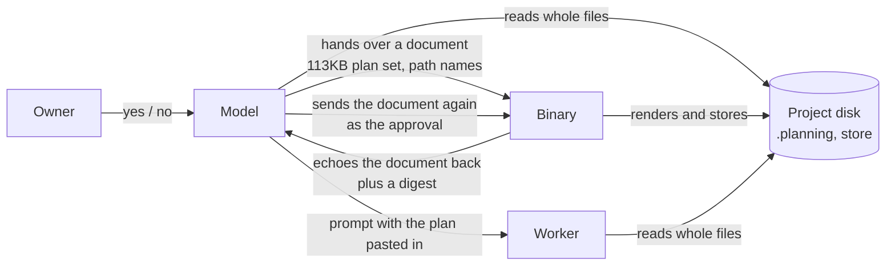
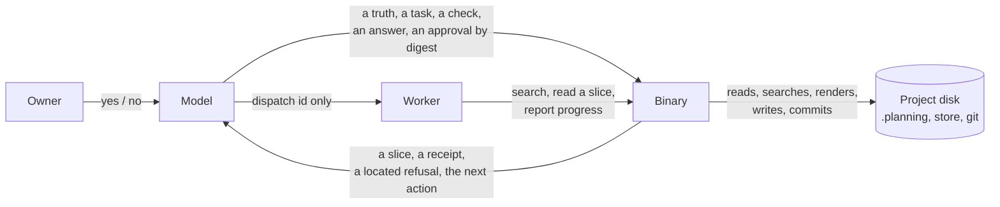

# The boundary fix

Supersedes the shape described in boundary.md. Approved 2026-09-12. Where the bytes go, and the rules in plain words. Every
operation on the tool surface is cut to this picture; an operation that does
not fit it is wrong, not an exception.

## Today (what the fix replaces)

The model reads project files itself, hands whole documents to the binary, and
gets them echoed back. The binary is told where things are.

## After the fix

The binary is bound to the project when it starts and owns every read, write
and render. The model hands over judgment in small typed pieces and gets back
slices, receipts and located refusals.

## Rules

1. **The binary is self contained.** It is started against a project and knows
   where everything lives. Nobody tells it a path.
2. **Nothing on the wire is a document.** Not in, not out. A document never
   crosses in either direction, and nothing is echoed back.
3. **The model hands over judgment, not bytes.** A truth, a task, a check, an
   answer, an approval. Each piece is small enough to reason about on its own.
4. **The binary renders every document.** PLAN.md, CONTEXT.md, SUMMARY.md and
   the rest are produced by the binary from the typed pieces and stored where
   it decides.
5. **The model reads through the binary.** It asks for a search or a slice and
   gets exactly that. It never opens a file. This is excerpt, inside the binary.
6. **Approvals bind by digest.** The owner approves what the binary holds,
   named by its digest, never by a copy. The binary answers a submission with
   the digest of the draft it rendered; the owner reads that draft; the
   approval carries owner, time and the digest; a draft changed since is
   refused with a location.
7. **A refusal points at a place.** The model may then ask for that slice and
   nothing more.
8. **Workers live under the same boundary.** A worker gets a dispatch id,
   talks to the binary the same way, and never reads a file whole either.

Writing source and tests stays with the worker and its own edit tools. That is
engineering judgment, and the model owns judgment. Around it, the worker reads
through the binary's search and slice, commits through the binary's rail, and
reports progress and completion as typed pieces instead of writing SUMMARY.md.

## What the fix touches

| Part | Today | After |
|---|---|---|
| Wire contract | Submit operations take a rendered body and echo it back | Submit operations take typed pieces; answers carry a digest and a receipt |
| Read layer | None; the model and the workers use Read and grep on the tree | Search and slice operations in the binary, ported from the excerpt crate |
| Rendering | The model authors the markdown | The binary renders it from the pieces |
| Stores and records | Content addressed by digest and revision | Unchanged |
| Model behaviour | Reads files, names paths, carries documents | Never does any of the three |
