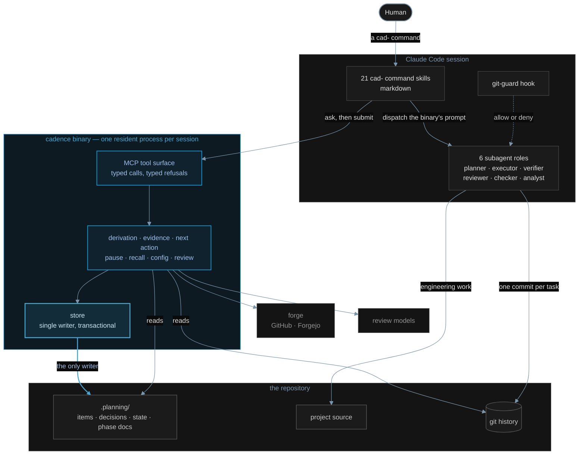

# Cadence 4.0 — the whole system on one page

The living picture of how Cadence is put together. When the design changes, this
changes with it. Module-level and workflow diagrams live beside this file, and
only for components that are actually built.

## What the picture says

**A human talks to skills. Skills talk to the binary. Only the binary writes.**

The skills are markdown and hold no logic worth the name: they ask the binary
what is next, hand that answer to a subagent, and give the subagent's result
back. Every decision that is a function of disk, git and config is the binary's.
Every decision that needs reading code or prose for meaning is the model's.

The subagents do the engineering. They read and change the project's source and
they make the commits, because that is judgment work and always was. What they
cannot do is write Cadence's own state: that goes back through the tool surface
as a typed patch the binary validates.

`.planning/` is the store and the store has one writer. `git history` is not a
side effect, it is where truth about what happened lives, which is why the
binary reads it rather than trusting anyone's report.

The dotted line is the one piece that decides without being asked: `git-guard`
sits in front of a subagent's own git commands and answers allow or deny.
