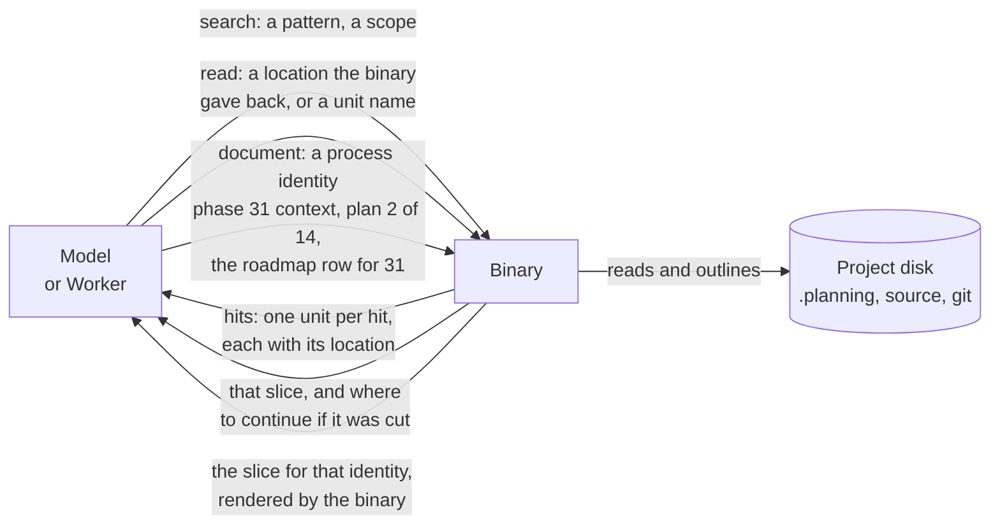

# The read layer

Approved 2026-09-12, phase 31. How the model and the workers read a project
once nothing on the wire is a document (`boundary-fix.md`, rule 5). Excerpt is
the template; this is cut to what Cadence needs, not excerpt fitted in.

Three calls, and two narrower ones beside them. Two come from excerpt. The
third is Cadence's own, because Cadence knows what a plan or a context is and
excerpt never did. John kept read and document as separate calls (2026-09-12).
`list` (a scope, no pattern) and `document-search` (a phase and a pattern)
were split out on 2026-09-16 so that each answers one exact question with one
shape, instead of riding on `search` as scopes whose hits it could not serve
the same way.

## The three calls, plainly

1. **search.** A pattern and a scope go in. What comes back is the enclosing
   unit of each hit, a function, a section, a class, with its location. This
   is how the model finds anything. It replaces grep.
2. **read.** A location goes in, one the binary handed back from a search, a
   refusal or a lease, or a unit name inside a file the binary already named.
   What comes back is exactly that slice. A file too big to serve whole comes
   back as an outline, one row per unit with its lines, so the next read is
   exact. This replaces Read and cat.
3. **document.** A process identity goes in: the context of phase 31, plan 2
   of phase 14, the roadmap row for phase 31, the summary of a task. What
   comes back is the slice the binary renders for that identity; a big record
   comes back in pieces, the truths of a context, one task of a plan. The
   model never learns the path. This is what makes boundary rule 1 hold.

## Rules the layer keeps

1. **The model never originates a location.** Every location it reads at was
   handed to it by the binary first: a search hit, a refusal, a lease, an
   outline row. Paths the model invents are refused.
2. **Every answer is bounded and says so.** A slice that was cut says where
   to continue. An outline says which unit to ask for. There is no answer that
   is the whole file by accident.
3. **Process documents are reached by identity, never by path.** The binary
   decides where CONTEXT.md and PLAN.md live and renders the slice. This is
   what closes the 93KB `context-intake` answer of 2026-09-12.
4. **One surface for every caller.** The main thread, a Claude worker and a
   Codex worker all reach the same three calls over the same MCP server.
   There is no second way to read.

## Excerpt is the template. What changes

| In excerpt | In Cadence | Why |
|---|---|---|
| read takes an absolute path the caller types | read takes a location the binary gave back | Boundary rule 1: nobody tells the binary a path |
| search scope is a directory or glob relative to the project | Same, plus one named scope the binary issues: this task's lease. `list` takes the same scope and no pattern | A worker under a lease should not have to spell the lease; a planner should not need a host glob to see what is there |
| No search over process records | `document-search` takes a phase and a pattern and answers with identities and parts for `document`, never bodies | Its caller always follows the hit into `document`, so a body in the hit only costs the bound |
| No notion of a plan, a context, a phase | The document call reads process records by identity | Cadence owns those records; only it knows where they are and how they render |
| Separate MCP server, deferred on main threads, opt-in per agent | Inside the cadence binary, on the one server every caller already has | The usage report showed excerpt only works where a harness names it; cadence is that harness |
| A steering hook nudges callers off grep and cat | The purpose truth refuses a phase whose recorded reads open a file whole | A truth with a check, not a nudge |
| Outline threshold 24KB, units per tree-sitter grammar (Rust, JS, Python, Markdown, JSON) | Kept as is, on excerpt's extractors; a C extractor is added on the grammar Cadence already declared | Measured on this tree already; no reason to change it |

## What phase 31 measures at close

One planner round on a real phase, reads recorded by the harness: how many
reads, how many opened a file whole (must be zero), and the token total
against the 3.7 planner median of 183k.
